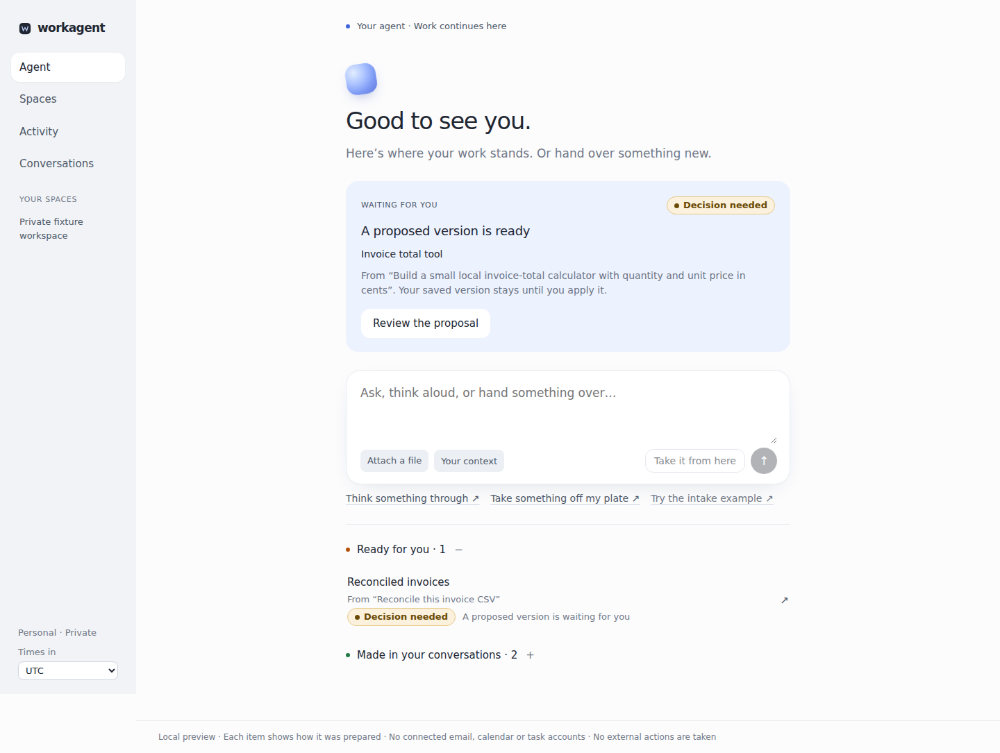
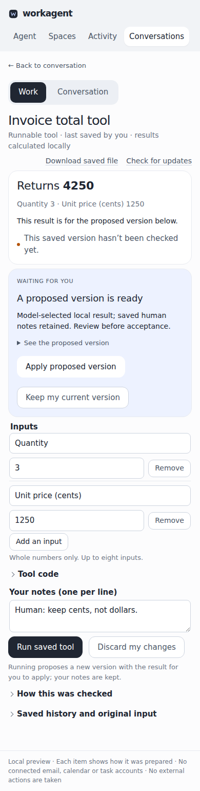

# Integrated model/work checkpoint — 2026-10-06

## Exact candidate and verdicts

Application **`1b81a1d742829663faf12a0ca5fa03957daf252c`**, tree
`3feade0009cdd41e5f9b49f97a258004c82470c2`, combines verified backend
`9ed2467b78a1fc92ed4b4a28b766c170a9617e35`, Claude frontend `a3c06fb`, and
small reviewed integration corrections. Both `hermes/general-model-integration`
and PR9's non-default integration branch carry the application. The running
checkout remains pinned to this application; evidence documentation is separate.

| Verdict | Observed result | Limit |
| --- | --- | --- |
| Engineering | PASS for this bounded checkpoint: backend487 tests, frontend91 tests,15 mock browser cases (plus Claude’s20 DOM cases on his frontend head); exact-head real-browser/API/PostgreSQL four-turn synthetic journey and restart; four live model-backed turns | Local checks and exact CI results are separate; no default merge/deployment |
| Usefulness | The live model independently selected useful CSV work, preserved saved edits, generated a working calculator and changed its code/form for shipping | This proves two specific work shapes, not general agency; Andrew's usefulness acceptance is pending |
| Experience | Actual ask/work/revise/leave/Home+Space decision/reopen paths, saved edits and phone panes demonstrated | FAIL against full seamless-product acceptance: rough edges below remain; no claim that the complete persistent partner is delivered |

The governing direction is Andrew's [behavior/experience note](https://github.com/alindebergASL/Workagent/pull/9#issuecomment-6018834683)
and [agency/coordination note](https://github.com/alindebergASL/Workagent/pull/9#issuecomment-6019150121),
incorporated in the four active contracts/plan at `770f669`.

## What Workagent accomplished independently

All four requests were natural-language messages in the actual UI. The client
supplied neither an operation selector nor calculator WAT. Official OpenAI
Responses, **`gpt-6.1-sol`, medium reasoning, default tier, store:true**, selected
bounded actions inside the existing GeneralWorker/ResponsesDispatcher/broker.
Actual local tool results were fed into the explanation phase.

| Turn | Actual result |
| --- | --- |
| CSV initial | Selected reconciliation; preserved original values/notes; reported total78.40 versus calculated77.40, discrepancy on rowB; created editable table and downloadable CSV |
| CSV revision | Used the exact human-saved table with B unit price12.495 and edited notes; selected HALF_EVEN; calculated77.38; left an exact pending proposal without overwriting the saved version |
| Calculator initial | Generated import-free WAT and a two-input form from the request, with no supplied code; actual Wasmtime49 execution returned3750 for3×1250 |
| Shipping revision | Generated different code and a three-input form; actual arguments `[3,1250,500]` returned4250; retained human notes and left the changed version pending |

Both pending proposals were read back against their actual saved base revisions;
both human notes were preserved. Neither live proposal was automatically accepted.
Home showed the calculator decision and the other CSV decision; the real
workspace Space provided stable artifact links. Reopened phone work retained the
decision and an unsent continuation draft.

### Explicit operator/test involvement

The operator supplied synthetic examples, typed the requests and human edits,
and installed the already authorized grant against exactly two source-free
conversation IDs. Home-created responses were paused only while those actual IDs
were bound to the grant; no result/operation was injected into the browser.
Known-ID pending Responses were resumed through the same worker with one read per
phase and a15-second wait, conserving the80-read ceiling. No generation was retried.

The live browser driver initially used the wrong accessible name for the reply
button. It stopped after the first completed CSV turn and saved human edit,
before submitting a revision. The operator corrected that selector and resumed
the remaining original turns using the same grant, IDs, ledger and saved work.
The calculator's first message was then entered in its already-created empty
conversation. No replacement generation, fresh grant or counter reset occurred.
This is not an uninterrupted automated Home demo, and not autonomous recovery by
the product from a broken test driver.

## Spending/authority readback — no allowance reset

Durable grant: `workagent-general-model-20261006-01`.

-4 admitted user turns;8 generations and8 token-count requests.
-16 same-ID retrievals;0 cancels; no unknown usage steps.
-Reported usage:25,246 input /1,215 output tokens.
-Conservative usage-based estimate **$0.0752650**; provider billing **not available**.
-Worst-case reservations **$1.05536**,160,000 input /65,536 output tokens.
-The $20 monetary ceiling and no calendar expiry are unchanged. The independent
  **four-turn/eight-generation/eight-count limits are exhausted**. Monetary
  headroom does not authorize more calls. Further paid testing needs an applicable
  explicit call/scenario allowance; routine deterministic development can continue.

The original authorization document, historical intake grants, pinned bundles and
accepted migrations remain unchanged. Private requests/receipts/key references
are not published. This report contains only synthetic observations and sanitized
counter metadata. No external business action, customer-data access, automatic
proposal acceptance, default merge or deployment occurred.

## What the tests establish

Backend full suite:487 passed, one existing Starlette/AnyIO deprecation warning.
The independent review found and then reproduced/fixed stale-target pre-I/O calls
and a four-turn SQL admission bypass, including REPEATABLE READ concurrency.
Final independent review passed117 focused/boundary tests on the exact backend
source. General admission/reservations require READ COMMITTED; already-dispatched
late receipt retention remains possible. Historical intake compatibility passed.

The final integration review passed the seven-file delta and91 frontend tests.
Actual-browser testing caught a frozen-progress bug when a provider phase was
transiently unknown. The UI now keeps **read-only** polling, distinguishes unknown
receipts from an absent consumer, preserves cancellation, and does not resend.
15 mock browser regressions passed separately; Claude reported20 focused DOM cases
on his frontend head, not a fresh exact-integrated-head DOM run. Frontend CI for
this exact application passed: https://github.com/alindebergASL/Workagent/actions/runs/37521172253 .
Backend gates above are local evidence, not a claim of all workflows rerunning.

The committed `scripts/verify_general_model_journey.py` / `.mjs` harness is
**synthetic-only** and uses real API/PostgreSQL/CSV/Wasm execution. It demonstrated
four UI turns, desktop/390/320 layouts, drafts, scoped Home/Space discovery,
explicit fixture acceptance, downloads and process restart on a clean exact head.
Its automatic fixture acceptance was **not used for the live test**.

Private local evidence:
-Backend `.local/parent-final-isolation.xml` in `workagent-general-responses`.
-Integrated `.local/model-journey-exact/{verification.json,browser-result.json,restart.json}`.
-Live `.local/general-live-01/{live-result.json,parent-verified-summary.json,operator-progress.json}`,
 screenshots and traces in the integrated checkout. Raw receipts remain private.

## Remaining product gaps and next behavioral checkpoint

- **M3 adaptive execution — planned/NOT TESTED.** Derive goals/success criteria,
  pursue multiple useful actions, inspect an obstacle and change approach within
  one responsibility. Four human-directed turns are not autonomous replanning.
- **M4 specialist coordination — planned/NOT TESTED.** Actual product-runtime
  delegation, scoped context/dependencies/shared budget, result reconciliation
  and failed/stale-child handling. The development agents are not product proof.
- **M5 persistent ownership — planned/NOT TESTED.** Event-driven ongoing
  responsibility, useful check-ins and pause/resume/cancel/takeover across runs.
  Saved conversations/restart recovery are necessary but insufficient.
- **Experience:** live explanations still display literal Markdown and long
  paragraphs. A pending calculator headline shows the proposed4250 with the saved
  two-input subtitle; the added shipping input is available in the proposed-version
  details, but the summary should distinguish those versions more clearly.
  The narrow two-conversation operator grant is test scaffolding, not seamless
  standing-permission onboarding. The exhausted test is for inspecting/reviewing
  saved work, not unrestricted new model turns.

Next behavioral checkpoint: implement/demonstrate bounded observation-driven
continuation on an obstacle/change scenario in the same runtime, with current
human edits and authority. Continue the existing Claude ownership for those
concrete surface gaps. Do not restart harness research or broaden paid authority.

## Actual experience

For access and exact saved links, see [current review walkthrough](../../docs/GENERAL_MODEL_REVIEW.md).
